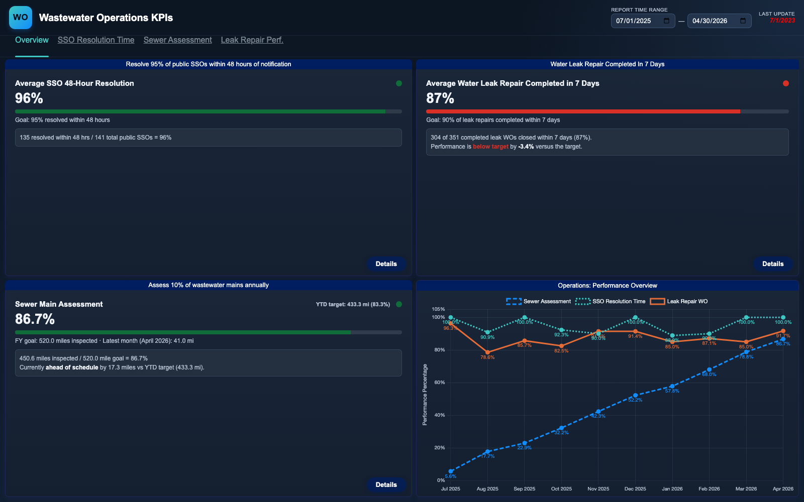
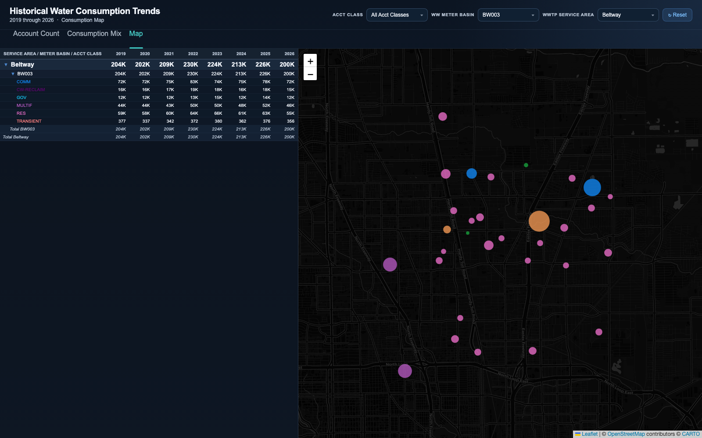
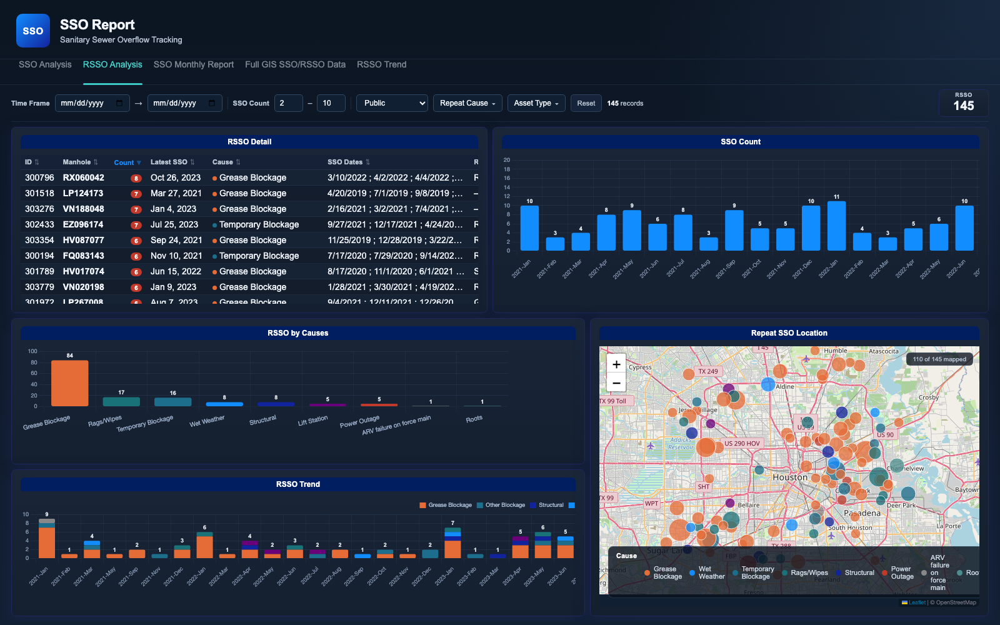
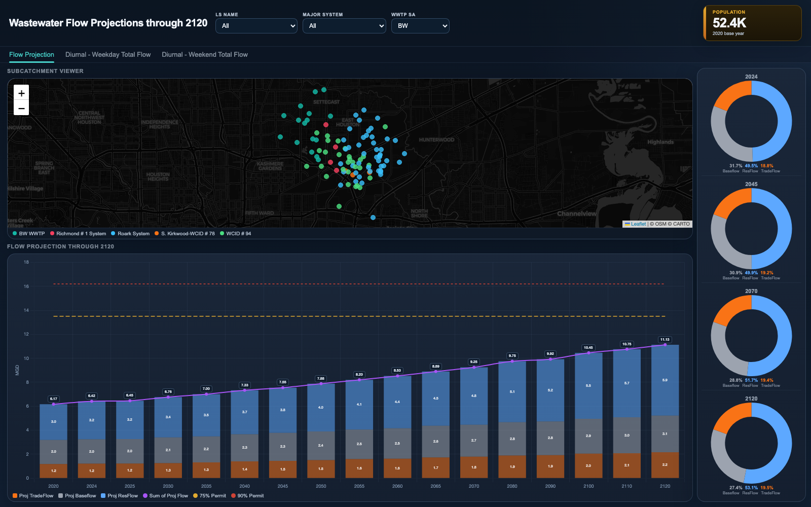

# Water Utility Operations Dashboards

Eleven interactive web dashboards built for the operations side of a large municipal water and wastewater utility, covering sewer overflow compliance, asset condition and renewal, capacity planning, and day-to-day maintenance analytics.

> **All data in this repository is synthetic.** Every dataset was generated by the seeded `generate_sample_data.py` script included in each folder. No real customer records, addresses, account numbers, asset identifiers, coordinates, work orders, or operational records appear anywhere in this repo, and all screenshots show synthetic data. Facility and service-area names that do appear are names of public infrastructure. This repository demonstrates engineering approach, not operational information.

## The story

Utility operations teams live in spreadsheets and enterprise system exports: work orders, overflow incident logs, inspection scores, billing extracts, flow projections. The job behind this repo was turning those raw extracts into analytical tools that operations staff, engineers, and executives actually open every day.

The defining constraint shaped everything: these dashboards deploy to locked-down environments where there is no web server, no build tooling, and no way to call an API. Every dashboard here is a self-contained static page that runs straight off a file share (`file://`). That constraint drove the architecture:

- **Data ships as JavaScript, not JSON.** `fetch()` does not work over `file://`, so each pipeline emits compact `data.js` files loaded via plain script tags, including lazy-loaded per-area map chunks attached through dynamic script injection.
- **All analytics run in the browser.** Filtering, pivoting, moving averages, fiscal-year calendars, and cross-filtering are computed client-side over flat record arrays. The production versions of these pages chew through 50k to 140k records without a framework.
- **Dependencies are vendored.** Chart.js and Leaflet ship inside each folder, so a dashboard is one folder you can copy anywhere and double-click.

Behind each dashboard sits a Python pipeline that flattens enterprise-system extracts (asset management exports, billing data, GIS layers, inspection databases) into these datasets. In this public repo, those pipelines are represented by deterministic, seeded generators that produce synthetic data with the exact same schemas, so every page renders and every filter works.

## Gallery

| | |
|---|---|
| [](operations-kpis/) | [](water-consumption/) |
| [](sso-reporting/) | [](flow-projections/) |

## The dashboards

Each folder is a self-contained chapter with its own README, screenshots, and data generator.

### Executive and compliance

- **[Operations KPI Dashboard](operations-kpis/)** - executive scorecard for three headline service commitments: resolving 95% of public sewer overflows within 48 hours, inspecting 10% of gravity mains annually, and closing 90% of leak repairs within 7 days, each with a drill-down page that recomputes from record level as slicers change.
- **[SSO Reporting Dashboard](sso-reporting/)** - five-page sanitary sewer overflow analysis: monthly trends by cause and asset type, geographic hotspot maps, and repeat-overflow (RSSO) location tracking tied to corrective-action status.
- **[Lateral SSO Analysis](lateral-sso-analysis/)** - overflows originating in lateral lines, split by public vs. private responsibility and tied to preventive inspection volumes (jetting, CCTV, smoke testing) to answer whether the reduction effort is working.

### Asset condition and renewal

- **[Manhole Remediation Estimation](manhole-remediation/)** - turns severity-scored manhole inspections into estimated work counts per remediation method, with an interactive decision-matrix flowchart encoding the disposition logic.
- **[Rehab Contracts Performance](rehab-contracts/)** - production and spend across ~40 concurrent sewer rehabilitation contracts: pipe bursting, CIPP lining, point repairs, with a canvas-drawn expenditure gauge tracking each contract against its awarded capacity.

### Planning and growth

- **[Wastewater Capacity Reservation Tracking](capacity-tracking/)** - the claims developers place on future treatment capacity when permits are approved: portfolio rollups, paid vs. pending status, and a cross-filtered reservation map.
- **[Wastewater Flow Projections](flow-projections/)** - 100-year flow forecasts per treatment service area charted against permitted plant capacity thresholds, with 24-hour diurnal curves showing how peak-hour flow scales across decades.
- **[Water Consumption Trends](water-consumption/)** - eight years of billed water consumption as a proxy for sewer flow, from service-area rollups down to per-premise map bubbles, with lazy-loaded map data chunks per area.

### Maintenance operations

- **[Treatment Plant Work Orders](treatment-plant-work-orders/)** - cross-filtered work-order analytics across 42 treatment plants: facility-by-month pivots, equipment-class breakdowns, and row-level drill-down with CSV export.
- **[Lift Station Work Orders](lift-station-work-orders/)** - the same analytical engine pointed at ~120 sewage lift stations, down to individual pump assets and telemetry alarm categories.
- **[Active Repair Work Orders](repair-work-orders/)** - water distribution repair backlog: daily and weekly opened-vs-closed trends with regression overlays and a running backlog series, filterable by council district.

## Running locally

```bash
git clone <this-repo>
```

Open any dashboard's HTML file directly in a browser. No server, no build step, no install.

To regenerate a dashboard's sample data:

```bash
cd <dashboard-folder>
python3 generate_sample_data.py
```

Generators are seeded and deterministic, use only the Python standard library, and document their schemas inline.

## Disclaimer

This is a portfolio repository. All datasets are fabricated by the included generators and any resemblance to real records is coincidental. Map basemaps are public OpenStreetMap and CARTO tiles; synthetic map points are random locations with no relationship to any real premise, asset, or incident.
