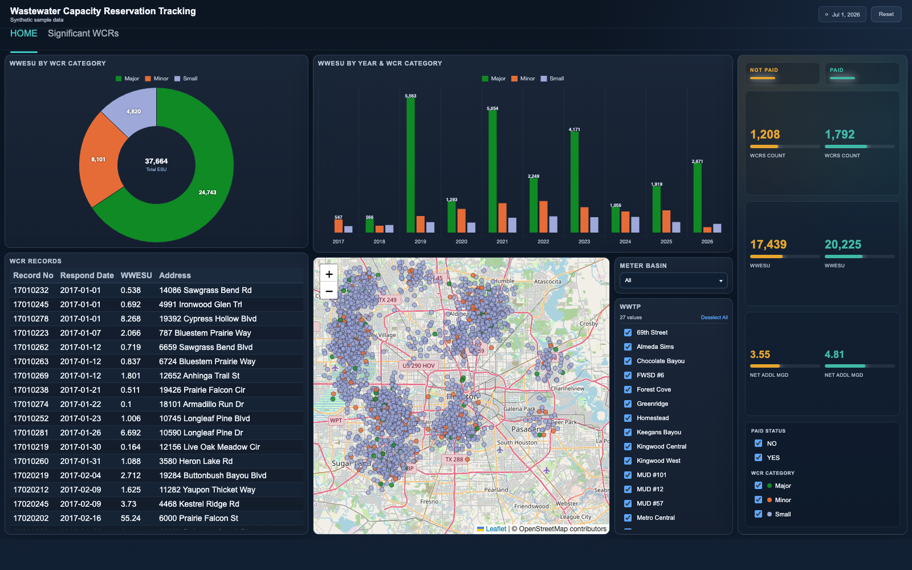
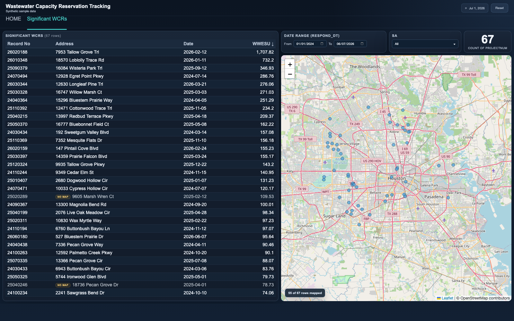

# Wastewater Capacity Reservation Tracking

When a developer wants to build, the wastewater utility must confirm the receiving
treatment plant has capacity for the new flow before a permit moves forward. Each
approval becomes a wastewater capacity reservation (WCR): a claim on future plant
capacity measured in equivalent service units (ESU) and million gallons per day (MGD).
This dashboard tracks those reservations across every treatment plant service area,
so planners can see where growth is concentrating and how much committed-but-unbuilt
demand is stacked against each plant.

The operational question it answers: how much future capacity has already been
promised, where, and how much of it is paid versus still pending? The home page
gives the portfolio view (category mix, yearly trend, paid/unpaid rollups, and a
map of every reservation), while the Significant WCRs page isolates the large
reservations (over 15 ESU) that individually matter for plant capacity planning.

## Pages

- `home.html` - overview: WWESU by category (donut), WWESU by year and category
  (stacked bars), record table, reservation map, and paid/not-paid KPI rollups,
  with slicers for meter basin, treatment plant service area, paid status, and category
- `significant-wcrs.html` - large reservations (WWESU > 15): sortable table with
  a date-range slicer, service-area filter, count card, and a linked map

## Tech notes

- Vanilla JS single-file pages, no build step; Chart.js for charts, Leaflet with
  OpenStreetMap tiles for the maps (both vendored locally under `assets/`)
- One shared data file (`data.js`) loaded as a script tag, so the pages run from
  the local filesystem with no server and no fetch calls
- Cross-filtering is implemented by hand: chart segments, bars, table rows, and
  map markers are all click-selectable, dimming the charts and narrowing the map
  and KPIs while the table keeps full context and only highlights
- Table rows and map markers stay in sync in both directions; selecting a single
  mapped record flies the map to it, and unmapped records are flagged with a
  "No map" chip and a map-coverage note
- Derived fields (WCR category thresholds, net additional MGD from ESU minus
  credits) are computed in the data pipeline, not in the UI

## Run it

Open `home.html` in a browser (an internet connection is needed for map tiles).

Regenerate the sample data at any time:

```
python3 generate_sample_data.py
```

All data in this folder is synthetic sample data.




