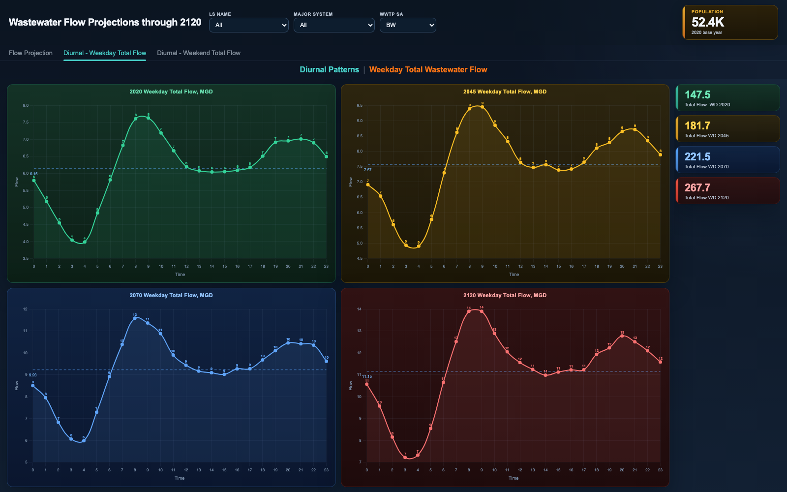

# Wastewater Flow Projections Dashboard

A single-page dashboard for exploring 100-year wastewater flow projections across a
large municipal collection system. Long-range planning for treatment plants hinges on
one question: when does projected flow in each service area approach the plant's
permitted capacity? This dashboard puts the answer on one screen - projected flow
(split into residential, commercial/industrial, and baseflow components) charted
against 75% and 90% permit-capacity thresholds for every service area, major
conveyance system, and lift station in the network.

A second pair of pages looks at diurnal patterns: how flow varies hour-by-hour over a
typical weekday and weekend, and how those 24-hour curves scale as the system grows
through 2045, 2070, and 2120. Peak-hour flow, not daily average, is what stresses
conveyance capacity, so planners need both views.


## Pages

All three pages live in `index.html` as tabs sharing one set of cascading filters
(service area -> major system -> lift station):

- **Flow Projection** - subcatchment map, stacked flow-component bars with permit
  threshold lines through 2120, and flow-mix donuts for 2024/2045/2070/2120
- **Diurnal - Weekday Total Flow** - 24-hour flow curves for 2020/2045/2070/2120
- **Diurnal - Weekend Total Flow** - same, for weekend patterns



## Tech

- Vanilla JS single file; no build step, no framework
- Chart.js 4 (+ datalabels plugin) for the combo bar/line chart, donuts, and diurnal
  curves; Leaflet 1.9 with CARTO dark basemap tiles for the subcatchment map
- Data pipeline: source flow-projection and diurnal tables are consolidated into one
  `data.js` payload (`DATA` for the numbers and map geometry, `CASCADE` for the
  three-level filter hierarchy), so the dashboard runs entirely client-side
- Filter changes re-render every chart, the map markers, and the map legend in place;
  the map auto-zooms to the selected service area or system centroid

## Run

Open `index.html` in a browser (an internet connection is needed for the CDN-hosted
libraries and basemap tiles). To regenerate the sample data:

```
python3 generate_sample_data.py
```

All data in this folder is synthetic sample data.
