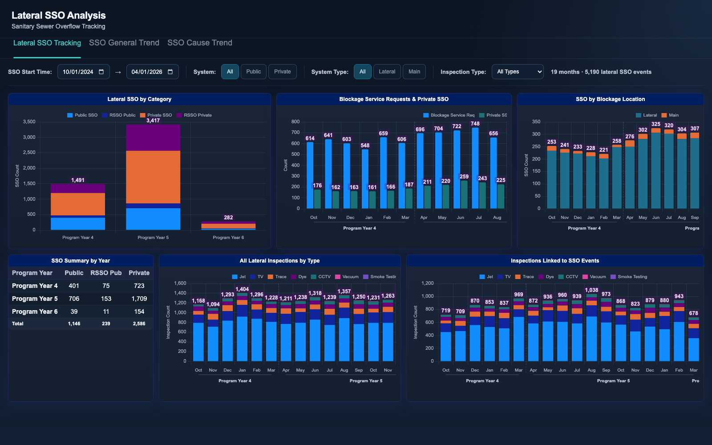
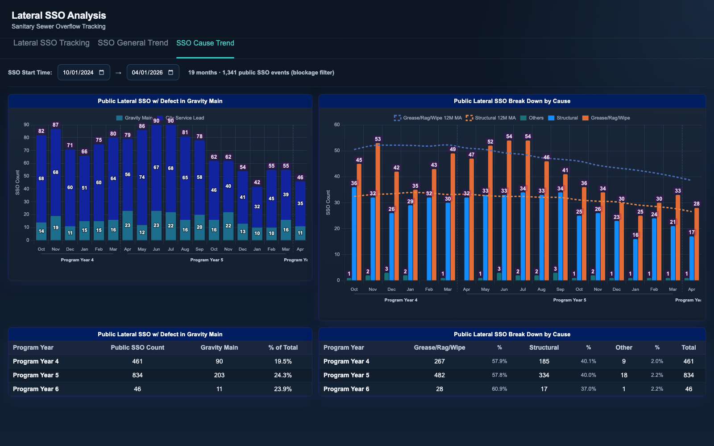

# Lateral SSO Analysis

An interactive dashboard for tracking sanitary sewer overflows (SSOs) that originate in
lateral lines, the small-diameter pipes connecting individual properties to the sewer
main. Overflows are split by responsibility (public system vs. private plumbing) and by
where the blockage occurred (lateral vs. main), and each program year is compared
against the last.

The operational question: is the lateral SSO reduction effort working? The pages tie
overflow counts to the inspection work meant to prevent them (jetting, TV/CCTV, dye and
smoke testing) and break down causes such as grease/rag/wipe blockages versus structural
defects, so reviewers can see whether spikes are seasonal noise or a real trend, and
whether inspection effort is landing where the overflows are.

## Pages

- `index.html` - Lateral SSO Tracking: category breakdown, blockage service requests,
  blockage location, yearly summary pivot, and inspection volumes by type
- `sso-general-trend.html` - SSO General Trend: monthly public/private trend with
  12-month moving averages, spike detection, and year-over-year change table
- `sso-cause-trend.html` - SSO Cause Trend: gravity main vs. service lead defects and
  cause categories (grease/rag/wipe, structural, other) with moving averages

## Tech notes

- Vanilla JS + Chart.js 4 (vendored in `assets/chartjs/`), no build step
- Custom Chart.js plugins draw grouped program-year bands below the x-axis and
  outlined data labels on bars and stack totals
- Charts render inside horizontal scroll containers sized per bar count, with
  wheel-to-horizontal-scroll behavior, so long month ranges stay readable
- All filtering (date range, public/private, lateral/main, inspection type) happens
  client-side; pivot tables and moving-average lines recompute on every slicer change
- The reporting calendar runs April through March ("Program Year"), so all aggregation is
  done against program years rather than calendar years

## Running

Open `index.html` in a browser. No server needed.

To regenerate the sample data:

```
python3 generate_sample_data.py
```

The script is seeded and deterministic. It writes `data.js` with monthly series
(trend + seasonality + noise) for overflow counts, cause breakdowns, and inspection
volumes across five program years.

All data in this folder is synthetic sample data.

## Screenshots




