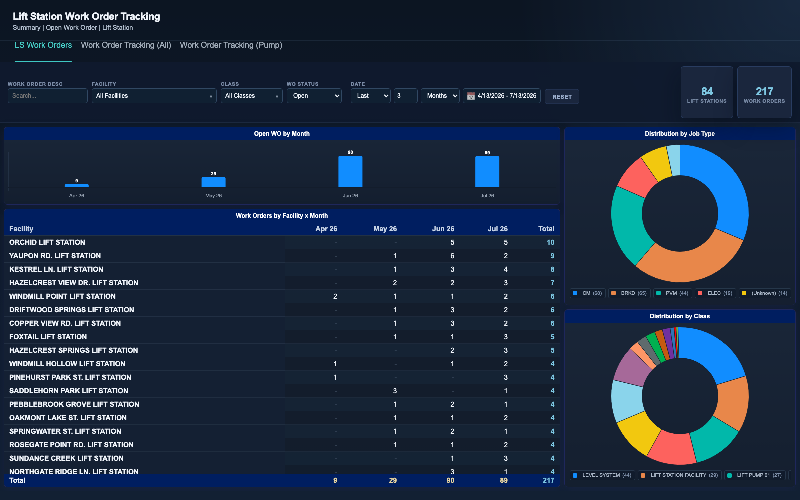
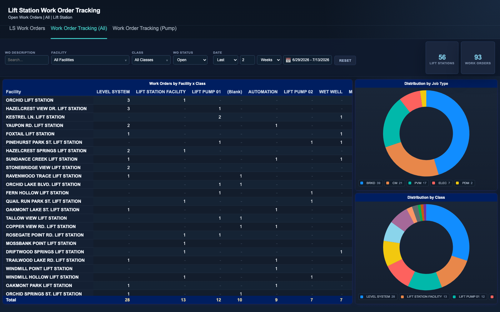

# Lift Station Work Order Tracking

Interactive dashboards for tracking maintenance work orders across a large
network of sewage lift stations. Work-order records exported from an
enterprise asset management (EAM) system are modeled into a single flat
table, and three linked views let operations staff answer the question:
*which lift stations are generating the most work right now, and what kind
of work is it?* Telemetry-driven level alarms, pump repairs, electrical
problems, and preventive maintenance can be sliced by facility, equipment
class, job type, status, and a relative or custom date window.

Every visual is cross-filterable: clicking a pivot row, donut slice, or
legend chip highlights that dimension across the page, and any cell, total,
bar, or slice drills down to the underlying work orders in a searchable
modal that exports to CSV.

## Pages

- `ls-wo-summary.html` - open work orders by month, facility-by-month pivot,
  and job type / class distributions
- `ls-workorders.html` - facility-by-equipment-class pivot of all work
  orders with job type and class donuts
- `ls-workorders-pump.html` - the same tracking view scoped to lift pump
  assets only (pump 01-07 classes)

## Tech notes

- Vanilla JavaScript + Chart.js 4 (local copy, no build step, no external
  network calls)
- Data ships as a single `window.WO_ROWS` array (`data-wo-ls.js`); all
  filtering, pivoting, and aggregation happens client-side in plain JS
- Custom cross-filter state machine (selection vs. slicer filters) mirrors
  the exclude-own-dimension semantics of BI tools, so a donut keeps its full
  distribution while every other visual filters to the selection
- Hover tooltips and drill-down modals are rendered from the same filtered
  row set, so counts always agree across visuals
- Relative date filter ("last N days/weeks/months/years") with a custom
  range picker

## Run it

Open any of the three HTML pages directly in a browser - no server needed.

To regenerate the sample data:

```
python3 generate_sample_data.py
```

The generator is seeded and produces ~3,500 work orders across 120
fictitious lift stations, with seasonal volume, skewed facility activity,
and status/age dynamics tuned so the default views look like a live system.

All data in this folder is synthetic sample data.

## Screenshots




