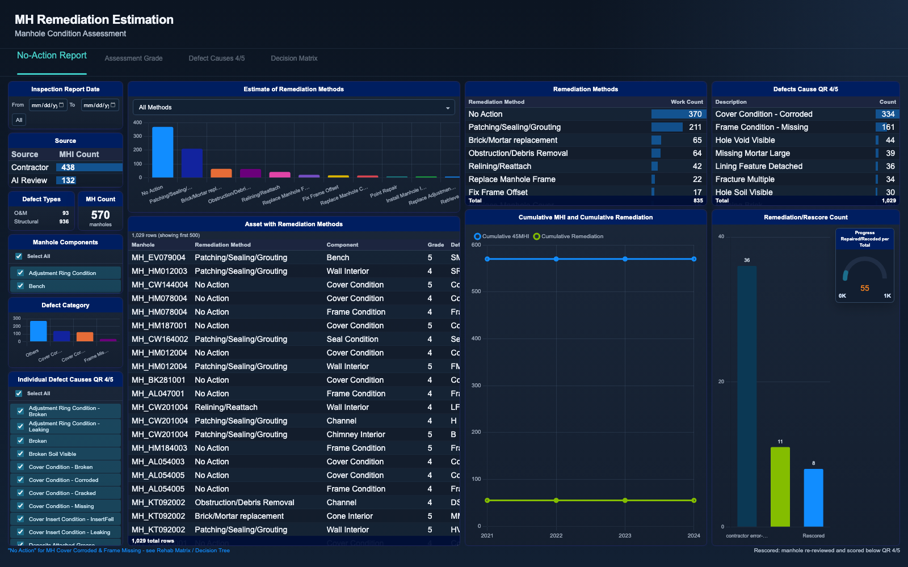
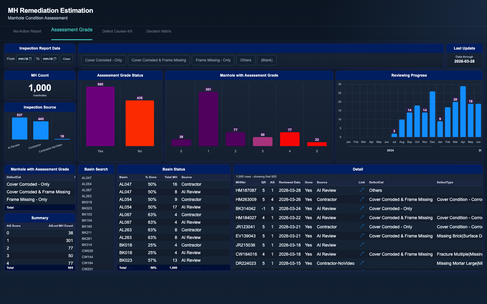

# Manhole Remediation Estimation Dashboard

An interactive web dashboard for planning manhole rehabilitation across a
large sanitary sewer collection system. Field crews and AI-assisted video
review score each manhole inspection using MACP (Manhole Assessment
Certification Program) quick ratings; every structure rated 4 or 5 needs a
decision: repair it, reline it, clear it, or accept "No Action" for cosmetic
defects such as a corroded cover. This dashboard answers the operational
question: **of the thousands of severe-rated manholes, how much real
remediation work is actually needed, of what kind, and where?**

It rolls individual defect observations up into estimated work counts per
remediation method, tracks the engineering review that assigns each manhole
an assessment grade, and documents the decision logic that maps defect codes
to fixing methods.

## Pages

| Page | What it shows |
| --- | --- |
| `index.html` | No-Action Report: estimated work counts per remediation method, defect-to-method detail table, remediation/rescore progress gauge |
| `assessment-grade.html` | Review progress: assessment-grade distribution, monthly reviewing throughput, per-basin completion status, inspection detail |
| `defect-causes-45.html` | Ranked bar chart of every defect cause behind QR 4/5 ratings, sliceable by manhole component |
| `decision-matrix.html` | Zoomable decision-tree flowchart mapping inspection findings to remediation actions, with priority criteria |

## Screenshots





## Tech notes

- Vanilla JavaScript + [Chart.js](https://www.chartjs.org/) (bundled locally); no build step, no server.
- Cross-filtering slicers (date range, components, defect causes, methods, basins) re-aggregate all charts and tables client-side.
- Custom Chart.js plugins for on-bar value labels and grouped year bands on the monthly progress axis.
- Data pipeline: inspection, defect, and remediation extracts are modeled into three joined tables (`DATA`, `DATA_DC45`, `DATA_NA`) keyed by inspection ID; work counts are distinct work items per fixing method.
- Detail tables cap rendering at 500 rows while aggregates always use the full filtered set.

## Run it

Open any of the HTML pages directly in a browser - no server needed.

To regenerate the sample dataset (seeded, deterministic):

```sh
python3 generate_sample_data.py
```

All data in this folder is synthetic sample data.
