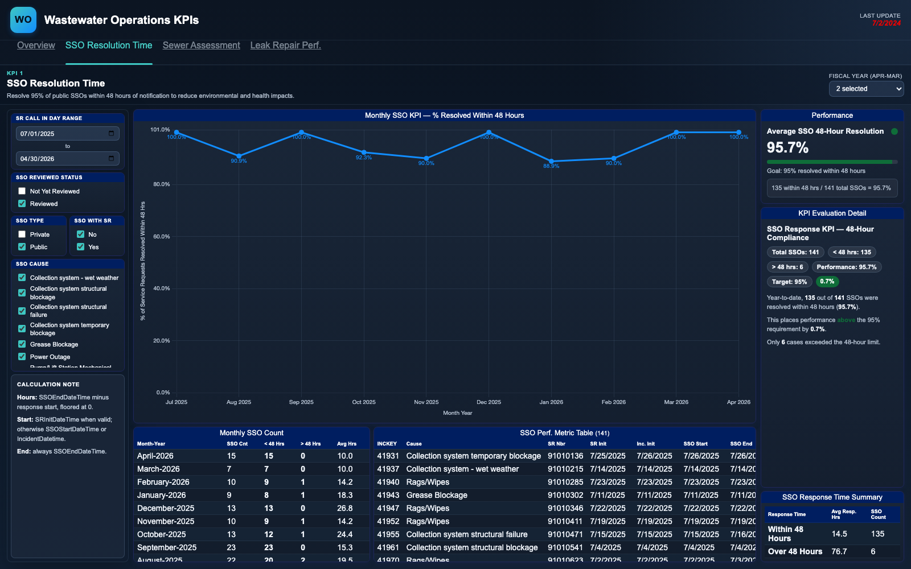

# Operations KPI Dashboard

An executive dashboard tracking three headline performance indicators for a large
wastewater/water utility: how fast sanitary sewer overflows (SSOs) are resolved,
whether the annual sewer-main CCTV inspection program is on pace, and how quickly
water leak repair work orders are completed. The overview page answers the
question "are we meeting our service commitments right now?" at a
glance, and each KPI links to a detail page that answers the follow-up question
"if not, where and why?"

Built for utility leadership: the overview mirrors how the KPIs are formally
stated (target, formula, variance), while the detail pages expose the
record-level evidence behind each number.

Each detail page recomputes its KPI client-side from record-level data, so every
slicer change (date range, fiscal year, SSO cause, review status) re-filters the
underlying incidents and work orders and rebuilds the charts, tables, and KPI
cards instantly - no server round trip.


## Pages

- `overview.html` - all three KPI cards plus a combined monthly performance trend line chart
- `sso-resolution.html` - % of public SSOs resolved within 48 hours (95% goal), with cause/type/review-status slicers, monthly rollup, and incident-level detail table
- `sewer-assessment.html` - miles of gravity sewer mains CCTV-inspected vs. a cumulative fiscal-year target (10% of the system annually), selectable by fiscal year
- `leak-repair.html` - % of leak repair work orders completed within 7 days (90% goal), incoming vs. completed volumes, and a slowest-first work-order detail table



## Tech notes

- Vanilla JavaScript + Chart.js (local copy, no CDN); no build step, no framework
- Data ships as a single `data.js` that assigns plain JS objects onto `window`,
  so the pages work over `file://` with zero network access
- Record-level filtering and aggregation (month spines, fiscal-year bucketing,
  rollups) run in the browser; custom Chart.js plugins draw the data labels
- Fiscal-year logic differs by KPI (Apr-Mar for SSO reporting, Jul-Jun for the
  inspection program) and is derived per-row at load time
- Upstream, the production pipeline validated and reshaped nightly extracts of
  incident and work-order data into these page-ready structures

## Run it

Open `overview.html` in a browser - that's it.

To regenerate the sample dataset:

```
python3 generate_sample_data.py
```

The script is seeded, so output is deterministic.

All data in this folder is synthetic sample data.
