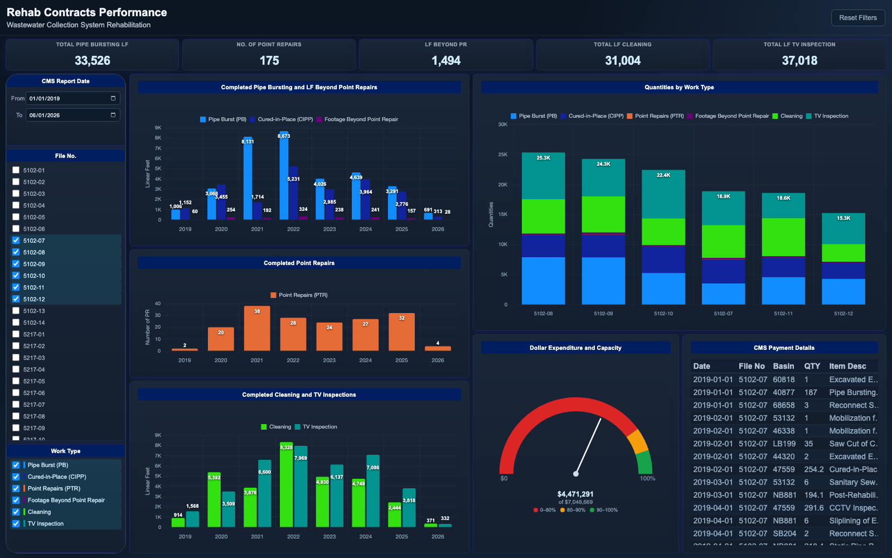

# Rehab Contracts Performance

An interactive dashboard for tracking a multi-year sanitary sewer rehabilitation
program across dozens of concurrent construction contracts. Each contract pays
out monthly against unit-price line items (pipe bursting, CIPP lining, point
repairs, cleaning, CCTV inspection, plus supporting restoration work), and the
program team needs one view that answers: how much work has each contract
actually completed, how is production trending year over year, and how close is
each contract to exhausting its awarded amount?

The page loads a flattened payment-line dataset and renders everything
client-side. Selecting contracts (file numbers), a work-type subset, or a
report-date window re-filters every visual instantly: KPI cards, three yearly
production charts, a per-contract stacked quantity chart, an expenditure gauge
that compares cumulative payments to total contract capacity, and a payment
detail table.

## Pages

- `index.html` - the full dashboard: KPI cards, contract / work-type / date
  slicers, yearly production charts, quantities by contract, expenditure
  gauge, and payment details table.

## Tech notes

- Vanilla JavaScript + Chart.js 4 (bundled locally in `assets/chartjs/`), no
  build step and no server required.
- All filtering happens in memory over a single row-level array; charts are
  rebuilt per interaction with custom Chart.js plugins for in-bar and
  stack-total value labels.
- The expenditure gauge is drawn directly on a canvas (arc segments, needle,
  threshold zones at 80% / 90% of contract capacity) and resizes with its
  panel.
- KPI cards intentionally ignore the work-type slicer (they are locked to
  their own work type) while respecting the contract and date filters,
  mirroring how pay-application summaries are reviewed.
- Data pipeline: payment line items are modeled as one row per pay item per
  monthly report (`RPT_DATE`, `FILE_NO`, `BASIN`, quantity, item description,
  work type, cost), joined client-side against a contract funding table
  (`TOTAL_AMT` and 80% / 90% thresholds) to drive the gauge.

## Running

Open `index.html` in a browser - no server needed.

To regenerate the sample dataset:

```
python3 generate_sample_data.py
```

## Screenshot



All data in this folder is synthetic sample data.
