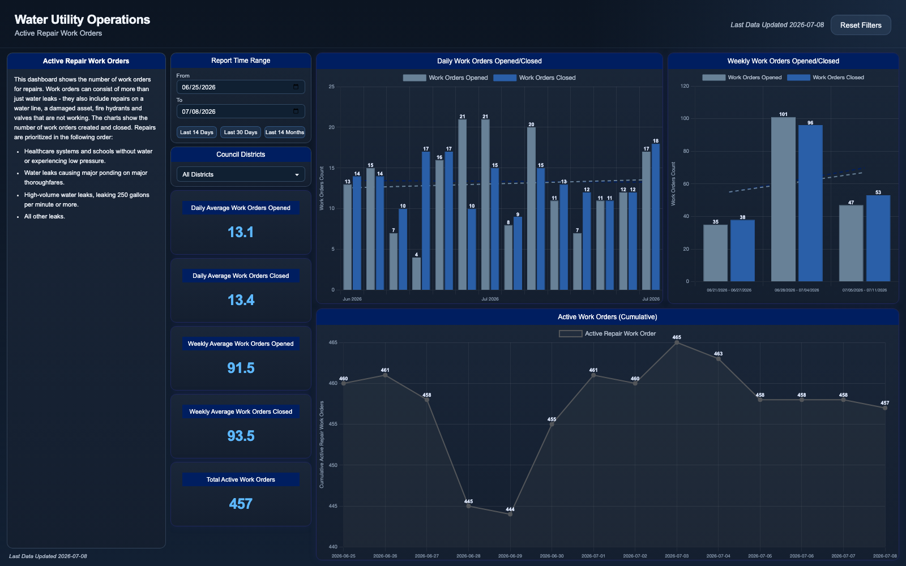

# Active Repair Work Orders

A single-page operations dashboard for tracking repair work orders across a
municipal water distribution system - water line leaks, damaged assets, fire
hydrants, and valves. It answers the day-to-day operational question: **is the
repair backlog growing or shrinking?** Crews open new work orders every day
and close others; if the open rate outpaces the close rate for long, the
backlog of unrepaired leaks climbs and response times slip.

The page compares work orders opened vs. closed at daily and weekly grain
(with linear trend overlays), tracks the cumulative count of active work
orders over time, and reports daily/weekly open-close averages plus the total
active backlog. Everything is filterable by report time range and by council
district.

## Pages

- `active-work-orders.html` - opened/closed daily and weekly bar charts with
  trend lines, cumulative active-work-order line chart, five KPI cards, date
  range and council-district slicers.

## Tech notes

- Vanilla JavaScript + [Chart.js](https://www.chartjs.org/) (bundled locally
  in `assets/chartjs/`), no build step, no server - runs entirely from the
  filesystem.
- One flat record set (`data.js`) is aggregated client-side into every view:
  per-day and per-Sunday-week open/close counts, least-squares trend lines,
  and a cumulative backlog series (running sum of opens minus closes).
- The weekly chart uses a custom viewport: a detached scrollbar drives which
  window of weeks is rendered, so long ranges stay readable without squashing
  the bars.
- Custom Chart.js plugins draw value labels above bars/points, thinning
  labels by pixel spacing so dense ranges do not overlap.
- KPI averages and chart aggregations respect both slicers; the "Total Active
  Work Orders" KPI is deliberately date-independent so it always reflects the
  current backlog.

## Run it

1. Open `active-work-orders.html` in a browser.
2. To regenerate the sample data: `python3 generate_sample_data.py`
   (deterministic - seeded RNG, ~10,000 rows with weekday cycles, seasonal
   peaks, freeze-event spikes, and heavy-tailed completion delays).

All data in this folder is synthetic sample data.
