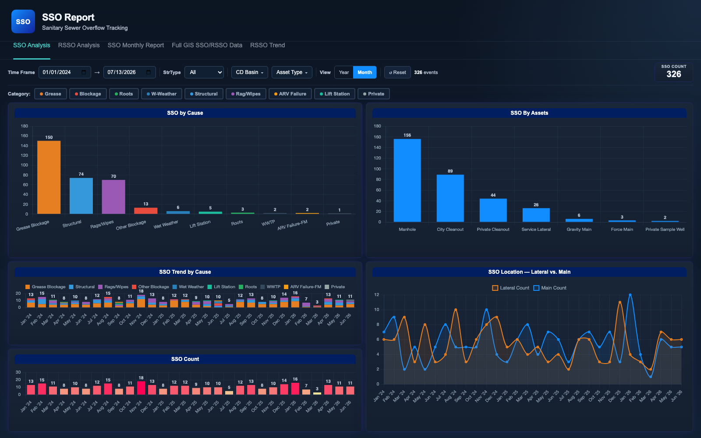

# SSO Reporting Dashboard

A multi-page web dashboard for tracking sanitary sewer overflows (SSOs) across a
large municipal wastewater collection system. It answers the questions an
operations and regulatory-compliance team asks every month: how many overflows
happened, what caused them, which assets are involved, where are they
concentrated geographically, and - most importantly - which locations are
overflowing repeatedly (RSSOs) and need capital or maintenance intervention.

Repeat SSOs get special treatment because consent-decree-style reporting
requires them: a location that overflows two or more times within a 24-month
window is flagged, tracked with its full overflow history, and tied to
corrective-action and contract status so engineers can see what is being done
about each hotspot.

## Pages

| Page | What it shows |
| --- | --- |
| `index.html` | SSO Analysis - cause/asset breakdowns, monthly and yearly trends, lateral vs. main split, with cross-filtering between charts |
| `rsso-analysis.html` | Repeat-SSO detail table, cause and trend charts, and a Leaflet map of repeat locations sized by overflow count |
| `sso-monthly-report.html` | Monthly reporting view - KPI cards, stacked trend by cause, cause totals, approximate locations map, and event detail table |
| `full-gis-data.html` | Full repeat-SSO dataset - sortable 19-column table linked to a bubble map (click a row to zoom the map) |
| `rsso-trend.html` | Repeat-SSO trend by cause with year/month drill, count distribution, and a sortable detail table |

## Tech notes

- Vanilla JavaScript, no framework and no build step - each page is
  self-contained HTML + CSS + JS.
- Chart.js (local bundle) for all charts, with custom inline plugins for
  bar-top value labels and stacked-column totals, and horizontally scrollable
  canvases for dense month-level views.
- Leaflet (local bundle) with OpenStreetMap tiles for the maps; markers are
  color-coded by cause and sized by repeat count, with table-row-to-map
  cross-linking.
- Click-to-cross-filter interactions: clicking a bar filters the other visuals
  on the page, with dismissable filter chips in the panel titles.
- Data is loaded from a single `data.js` file exposing five window-scoped
  datasets, produced by a Python pipeline that normalizes raw overflow records
  (cause normalization, repeat-count windows, month bucketing) into the shapes
  each page consumes.

## Running it

Open any of the HTML pages directly in a browser - no server needed.

To regenerate the sample data:

```
python3 generate_sample_data.py
```

## Screenshots




All data in this folder is synthetic sample data.
