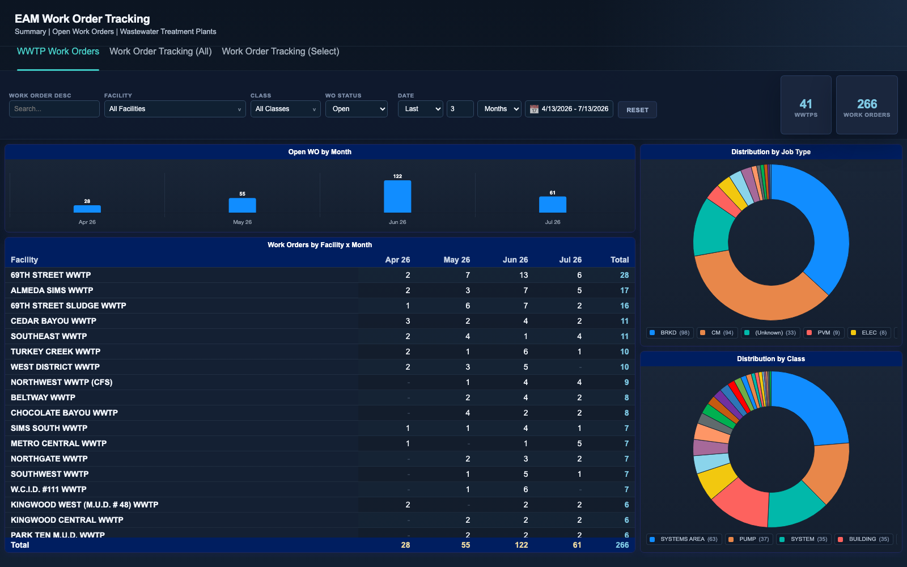
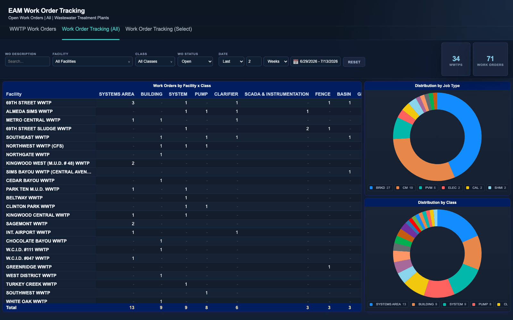

# Treatment Plant Work Orders

Interactive dashboards for tracking open maintenance work orders across a
network of 42 wastewater treatment plants. Maintenance activity is exported
from an enterprise asset management (EAM) system as a flat work-order table;
these pages turn that table into a live operational picture: where the open
backlog is concentrated, which equipment classes are generating the most work,
and how volume is trending month to month.

The operational question they answer: "Which plants and equipment classes need
maintenance attention right now?" Supervisors can slice by plant, equipment
class, status, and any date window, then drill from any chart cell, bar, or
donut slice straight down to the underlying work orders and export them to CSV.

## Pages

- `wwtp-wo-summary.html` - open work orders by month (bar), facility x month
  pivot, and job-type / class donuts. Default view: last 3 months.
- `wwtp-workorders.html` - facility x equipment-class pivot with job-type and
  class donuts, across all equipment classes. Default view: last 2 weeks.
- `wwtp-workorders-select.html` - same layout, pre-filtered to the eight core
  process equipment classes (pumps, blowers, clarifiers, basins, etc.).

## Tech notes

- Vanilla JavaScript + Chart.js 4 (bundled locally, no build step, no network
  calls). Works from the filesystem via `file://`.
- All charts cross-filter: selecting a facility row, donut slice, or month bar
  filters every other visual on the page; clicking through opens a searchable
  drill-down table with CSV export.
- Filters include multi-select searchable dropdowns (facility, class) and a
  relative/custom date-range picker, all rendered without any UI framework.
- Data is a single generated JS file (`data-wo-wwtp.js`) exposing
  `window.WO_ROWS`; each row carries work order number, description, dates,
  job type, status, location ID, facility, asset code/description, and
  equipment class.

## Running

Open any of the HTML pages in a browser - no server needed.

Regenerate the sample data (spans the ~30 months ending on the day you run it,
so the relative date filters always have data):

```
python3 generate_sample_data.py
```

## Screenshots





All data in this folder is synthetic sample data.
