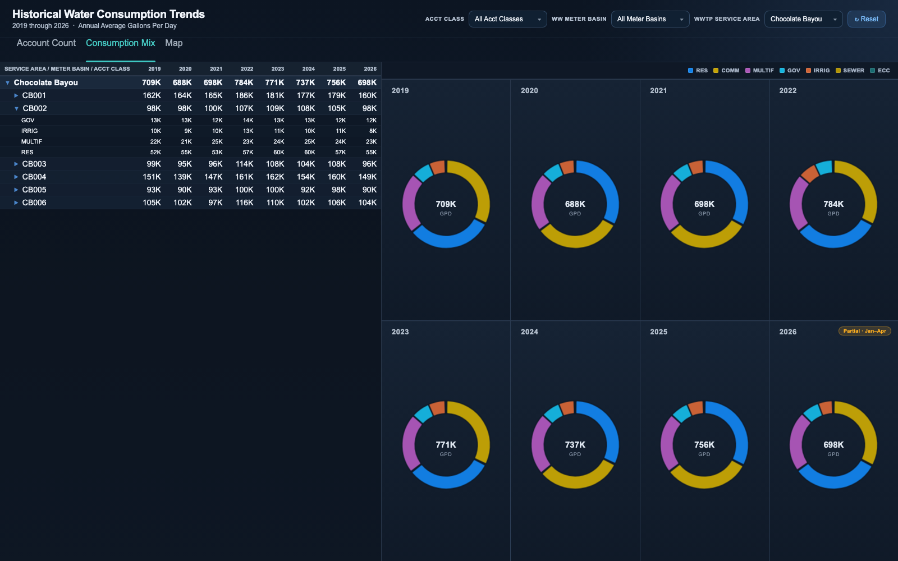

# Water Consumption Trends Dashboard

An interactive three-page dashboard for exploring eight years of billed water
consumption (2019-2026) across 41 wastewater treatment plant service areas.
Billed water use is a practical proxy for the sewer flow each treatment plant
has to handle, so the operational question here is: how much water is being
consumed in each plant's service area, which customer classes drive it, and
how is that changing year over year? Planners use this view to spot growth,
compare meter basins within a service area, and sanity-check capacity and
flow-projection work.

Every view cross-filters: slicers cascade (picking a service area narrows the
meter basin and account class options), clicking a pivot row or cell filters
the charts, and clicking a donut slice or map bubble filters the pivot.

## Pages

- `home-pie.html` - consumption mix: expandable service area > meter basin >
  account class pivot beside one donut per year (annual average gallons per
  day), with a partial-year badge for years still in progress
- `account-count.html` - the same layout aggregated by active account count
  instead of consumption
- `map.html` - per-premise consumption bubbles on a dark basemap, sized by
  gallons per day and colored by account class, alongside the pivot

## Tech notes

- Vanilla HTML/CSS/JS, no build step; runs straight from the filesystem
- Chart.js 4 (donuts) and Leaflet 1.9 with token-free CARTO/OpenStreetMap
  tiles (both libraries vendored under `assets/`)
- Data is prepared offline by a Python pipeline that aggregates raw billing
  records into a compact `data/data.js`, plus one map-chunk file per service
  area under `data/map/` that lazy-loads via script tag only when that
  service area is selected, keeping initial page load small
- Custom multi-select slicer widget with search, select-all, and cascading
  option lists shared across all three pages

## Run it

Open `home-pie.html` (or either other page) in a browser. To regenerate the
sample dataset:

```
python3 generate_sample_data.py
```

## Screenshots




All data in this folder is synthetic sample data.
